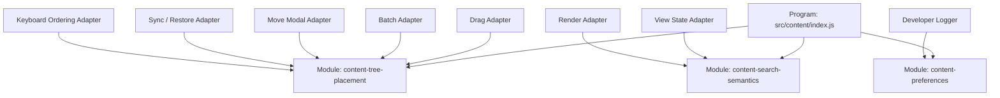

# Architecture Deepening and Accessibility Implementation Plan

> **For agentic workers:** REQUIRED SUB-SKILL: Use superpowers:subagent-driven-development (recommended) or superpowers:executing-plans to implement this plan task-by-task. Steps use checkbox (`- [ ]`) syntax for tracking.

**Goal:** 在数据与拖拽行为稳定后，把分散在 drag、batch、move modal、sync、restore/import 中的树放置不变量收口到一个有 Depth 的 Tree Placement Module，把 render/view-state 重复的搜索语义收口到 Search Semantics Module，并用同一 Placement Interface 提供键盘可达的精准排序。

**Architecture:** 本计划按 Program → Module → Interface → Function 分层。`index.js` 继续是 Program 的 composition root；Tree Placement Module 只拥有 domain state 的 validate → plan → commit，不触碰 DOM、Chrome API、toast、render 或 save；drag/modal/sync/restore 是 Adapter。Search Semantics Module 只返回纯 criteria/match/segment 数据，render 仍拥有 DOM。Preferences Module 必须完整拥有 load/save/optimistic rollback lifecycle，并从 developer logger 分离。

**Tech Stack:** Vanilla JavaScript IIFE factory、`globalThis.NSM_CREATE_*`、Jest、现有 DOM harness、Chrome MV3 manifest load order、三语 `chrome.i18n`。

**Global Constraints:**

- 此阶段不改变 schema version、storage key、extension permissions、host permissions 或 drag product semantics。
- 新 content helper 同步更新 `manifest.json`、`tests/helpers/load-content-module.js`、`tests/helpers/content-test-harness.js`、`docs/PROJECT_DIRECTORY.md` 和 `CHANGELOG.md`。
- 不按 LOC 机械拆 `content-tree-interactions.js`、`content-render.js` 或 `index.js`。只有多个 consumer 共用的 invariant/semantics 才提取。
- 每次只迁移一类 consumer；旧路径在该 consumer focused tests 通过前不删除。
- Tree Placement Module 不调用 save/render；Adapter 仅在 `result.changed === true` 时持久化和重渲染。
- 新键盘能力通过现有可键盘操作的 action controls 提供，不增加全局快捷键，避免与 Gemini Notebook/浏览器冲突。
- 所有新增文案同步 en/es/zh_CN；live announcement 不含私有来源标题，使用 item type、方向和位置计数。
- 开始 Task 1 前执行 `git rev-parse HEAD`，把返回值写入
  `docs/superpowers/reports/2026-07-26-optimization-baseline.md` 唯一的
  `Architecture Plan Start SHA:` 字段；若 report 不存在，先执行路线图 Task 1。不得依赖
  跨 shell 临时变量。
- 每个 commit 前运行 `git diff --check`，commit 后运行
  `git show --check --oneline --stat HEAD`。

---

## Target Module Map



Depth test：

- 删除 Tree Placement Module 会迫使至少五个 consumer 重新实现 entry shape、source XOR、cycle guard、no-op 与 index correction，因此 Module 有 Depth 和 Leverage。
- 删除 Search Semantics Module 会迫使 view/render 重新复制 parser、matcher、highlight normalization，因此 Module 有 Depth。
- Preferences Module 必须拥有完整 load/save/optimistic rollback lifecycle；若实现无法达到该边界，
  Task 8 判定失败并停止本计划，不得以取消 Task 8 或提交 shallow wrapper 作为完成。

---

## Task 1: Characterize 现有 tree placement behavior

**Files:**
- Modify: `tests/content/content-tree.test.js`
- Modify: `tests/content/content-drag-multi.test.js`
- Modify: `tests/content/content-modal-move.test.js`
- Modify: `tests/content/content-state-apply.test.js`
- Modify: `tests/content/content-state-reconcile.test.js`
- Modify: `docs/superpowers/reports/2026-07-26-optimization-baseline.md`
- Modify: `CHANGELOG.md`

**Interfaces:**
- Consumes: 当前 production Implementation。
- Produces: 后续重构不可改变的 behavior matrix。

在 characterization 前，把本计划开始时 `git rev-parse HEAD` 的原始 40 位输出写入 baseline
report 的 `Architecture Plan Start SHA:` 唯一字段；该 report 与本 task 一起提交。

- [ ] **Step 1: 增加 characterization cases**

锁定：

1. source 在 `group.children`、`state.root`、`state.ungrouped` 只能存在一次；
2. duplicate precedence：reachable group > positioned root > ungrouped；
3. same-container move 先移除原项再修正 insertion index；
4. original slot drop 是 no-op，不 save/render；
5. group 不得移入自身或后代；
6. batch move 保持输入顺序；
7. Move modal 追加到目标 group 尾部；
8. restore 时 live orphan source 进入 ungrouped；
9. root/group 使用 object entry，bin 使用 bare source key；
10. 新 subgroup 原子插入指定 parent children；
11. 删除 non-empty nested group 时 direct sources 进 bin、child groups 按原顺序提升到
    root，而不是原 parent。

- [ ] **Step 2: 运行 behavior baseline**

Run:

```bash
npm run test:unit -- --runTestsByPath \
  tests/content/content-tree.test.js \
  tests/content/content-drag-multi.test.js \
  tests/content/content-modal-move.test.js \
  tests/content/content-state-apply.test.js \
  tests/content/content-state-reconcile.test.js
```

Expected: PASS。该 task 是 characterization exception，不改 production；若某 case 失败，
先核对测试是否准确描述现有/已批准行为，不在本 task 顺手修 runtime。

- [ ] **Step 3: Commit**

```bash
git add tests/content/content-tree.test.js \
  tests/content/content-drag-multi.test.js \
  tests/content/content-modal-move.test.js \
  tests/content/content-state-apply.test.js \
  tests/content/content-state-reconcile.test.js \
  docs/superpowers/reports/2026-07-26-optimization-baseline.md \
  CHANGELOG.md
git commit -m "test: characterize tree placement behavior"
```

---

## Task 2: 建立有 Depth 的 Tree Placement Module

**Files:**
- Create: `src/content/content-tree-placement.js`
- Create: `tests/content/content-tree-placement.test.js`
- Modify: `src/content/index.js`
- Modify: `manifest.json`
- Modify: `tests/helpers/load-content-module.js`
- Modify: `tests/helpers/content-test-harness.js`
- Modify: `docs/PROJECT_DIRECTORY.md`
- Modify: `CHANGELOG.md`

**Module:**

```javascript
createContentTreePlacement({
    getState,
    getGroupsById
})
```

**Interface:**

```javascript
{
    locateItem(item),
    previewPlacement(command),
    applyPlacement(command),
    applyBatchPlacement(command),
    applyPlacementTransaction(commands),
    addGroup(command),
    removeSource(command),
    removeGroup(command),
    validatePlacementState(model),
    normalizePlacementState(model),
    commitPlacementModel(normalizedModel),
    sweepPositionedRootSourcesToBin(),
    rebuildParentMap(targetMap)
}
```

Domain types：

```javascript
// Item
{ kind: 'source', key: string }
{ kind: 'group', id: string }

// Semantic target
{
    container: 'root' | 'ungrouped' | 'group',
    groupId?: string,
    index: number
}

// Command
{ item, target }

// Structural commands
{
    group: GroupRecord,
    target:
        { container: 'root', index: number } |
        { container: 'group', groupId: string, index: number }
} // addGroup
{ item: { kind: 'source', key: string } } // removeSource
{ item: { kind: 'group', id: string } } // removeGroup

// PlacementPatch
{
    root: TreeEntry[] | null,
    ungrouped: string[] | null,
    groupChildrenById: Map<string, TreeEntry[]>,
    groupRecordsToSet: Map<string, GroupRecord>,
    groupIdsToDelete: string[]
}

// PlacementPreview
{
    ok: boolean,
    reason:
        'ready' |
        'no_change' |
        'not_found' |
        'invalid_target' |
        'cycle',
    from: object | null,
    to: object | null,
    patch: PlacementPatch | null
}

// PlacementResult
{
    ok: boolean,
    changed: boolean,
    reason:
        'moved' |
        'inserted' |
        'removed' |
        'no_change' |
        'not_found' |
        'invalid_target' |
        'cycle',
    from: object | null,
    to: object | null
}

// BatchResult
{
    ok: boolean,
    changed: boolean,
    reason:
        'moved' |
        'partial' |
        'no_change' |
        'not_found' |
        'invalid_target' |
        'cycle',
    moved: Item[],
    skipped: Array<{
        item: Item,
        reason: 'no_change' | 'not_found' | 'invalid_target' | 'cycle'
    }>
}

// TransactionResult
{
    ok: boolean,
    changed: boolean,
    reason:
        'committed' |
        'no_change' |
        'not_found' |
        'invalid_target' |
        'cycle',
    results: PlacementResult[]
}

// ValidationResult
{
    ok: boolean,
    errors: Array<{
        code:
            'invalid_entry' |
            'duplicate_source' |
            'missing_group' |
            'group_cycle' |
            'unknown_source',
        item: Item | null
    }>
}

// CommitResult
{
    ok: boolean,
    changed: boolean,
    reason: 'committed' | 'no_change' | 'invalid_model',
    validation: ValidationResult
}
```

`TreeEntry` 与 `GroupRecord` 沿用现有 state shape。Module 内部一律使用 `Map`；
Adapter 若持有 plain object，仅在 Interface 边界转换，不让两种 representation 混入同一
transaction。

**Implementation invariants:**

- source/group entry shape conversion；
- 防御性从全部旧 container 移除；
- same-list insertion index correction；
- no-op detection；
- group cycle detection；
- source XOR invariant；
- group 不进入 ungrouped；
- batch stable order；
- new group insert 同时写 `groupsById` + tree edge；
- source removal 从全部 container 防御性清除；
- group delete 将 direct sources 送 ungrouped、child groups 按原顺序提升到 root，
  完成后才删除 group record；这是现有 nested-group delete 行为，不在重构中改成提升到原
  parent；
- `addGroup` 接受 root 或现有 group target；`removeSource` 固定清除全部副本；
  `removeGroup` 固定执行 direct-source-to-ungrouped + child-group-promotion policy，
  Adapter 不传可漂移的删除策略；
- `applyPlacementTransaction(commands)` 在 working clone 上顺序 preview 全部 command，
  合并成一个 patch；任一 command 失败则不 commit；
- `addGroup`、`removeSource`、`removeGroup` 都构造单一 `PlacementPatch` 并共用同一个
  `commitPatch`，禁止先改 group record 再改 tree edge；
- 完整 validation 成功前不 mutate。

- [ ] **Step 1: 写 factory/Interface 失败测试**

新增：

- `applyPlacement moves a source from bin to root using object entry shape`
- `applyPlacement removes stale duplicates from every old container`
- `applyPlacement reports no_change without mutation`
- `applyPlacement rejects a group-to-descendant cycle atomically`
- `applyBatchPlacement preserves source order`
- `applyPlacementTransaction rejects all commands when one command is invalid`
- `addGroup commits the group record and root edge atomically`
- `addGroup commits a nested subgroup record and parent edge atomically`
- `removeSource clears every stale duplicate`
- `removeGroup sends direct sources to the bin and promotes child groups to root in order`
- `normalizePlacementState applies group-root-bin precedence`
- `normalizePlacementState returns a new Map and never mutates import input`
- `commitPlacementModel revalidates its carried liveSourceKeys and rejects a tampered normalized
  model without live state/Map mutation`
- `sweepPositionedRootSourcesToBin is stable and idempotent`

- [ ] **Step 2: 运行并确认红灯**

Run:

```bash
npm run test:unit -- --runTestsByPath \
  tests/content/content-tree-placement.test.js \
  tests/content/content-module.test.js
```

Expected: FAIL，factory/global 尚不存在。

- [ ] **Step 3: 实现纯 Module**

`previewPlacement` clone 需要改变的 list，完成 locate/target/cycle/no-op 验证后返回上文
`PlacementPreview`；失败/no-op 时 `patch:null`。`applyPlacement` 只 commit 完整
`PlacementPatch` 并返回 `PlacementResult`。`applyPlacementTransaction` 对 working clone
顺序 preview，成功时一次 commit 合并 patch，失败时 state 与 `groupsById` byte-for-byte
不变。不得把半完成 mutation 留在失败 result。

`normalizePlacementState({ state, groupsById, liveSourceKeys })` 是 pure operation，不修改
任何输入；内部先把 plain object/Map 转成新的 `Map`，固定返回 success/failure union：

```javascript
{
    ok: true,
    changed,
    state,
    groupsById,
    liveSourceKeys,
    removedDuplicates,
    removedCycles,
    movedOrphans
}

{
    ok: false,
    changed: false,
    reason: 'invalid_model',
    state: null,
    groupsById: null,
    liveSourceKeys: null,
    removedDuplicates: 0,
    removedCycles: 0,
    movedOrphans: 0
}
```

source precedence 固定 group → root → bin；group cycle edge 被删除，其余合法 siblings
保持顺序；live orphan 追加到 bin。返回的 `state` 是保留非 placement fields 的新对象，
返回的 `groupsById` 永远是新的 `Map`；import Adapter 需要 persisted plain object 时在
边界显式 `Object.fromEntries(result.groupsById)`。返回的 `liveSourceKeys` 永远是新的
`Set`，作为 commit-time validation context，不依赖 factory 的外部 getter。

`validatePlacementState({ state, groupsById, liveSourceKeys })` 只读校验显式 model；
`groupsById` 接受 `Map` 或 plain object，`liveSourceKeys` 接受 `Set` 或 array，供 import
preview 使用；`normalizePlacementState` 接受相同显式 model，因此不会为了校验导入而
触碰当前 runtime。runtime Adapter 对 pure result 调
`commitPlacementModel(normalizedModel)`；该方法用 result 自带的 state/Map/Set 重新调用
`validatePlacementState`，再在同一同步
critical section 替换 live `state.root`、`state.ungrouped` 与 `groupsById` 内容。失败时
不改任一 live container，并返回完整 `CommitResult` + failed `ValidationResult`；
success 返回 `CommitResult`，reason 为 `committed` 或 `no_change`。

- [ ] **Step 4: 接入无 bundler load order**

- manifest：在 `content-tags.js` 后、`content-state-reconcile.js` 前加载；
- Node loader 同位置 require；
- harness 加/清 `NSM_CREATE_CONTENT_TREE_PLACEMENT`；
- `index.js` 在组装 drag/sync/restore consumer 前 instantiate。

- [ ] **Step 5: 运行 tests + loader guard**

Run:

```bash
npm run test:unit -- --runTestsByPath \
  tests/content/content-tree-placement.test.js \
  tests/content/content-module.test.js \
  tests/manifest-loader-sync.test.js
```

Expected: PASS；Module 无 DOM/Chrome/save/render/toast dependency。

- [ ] **Step 6: Commit**

```bash
git add src/content/content-tree-placement.js \
  tests/content/content-tree-placement.test.js \
  src/content/index.js manifest.json \
  tests/helpers/load-content-module.js \
  tests/helpers/content-test-harness.js \
  docs/PROJECT_DIRECTORY.md CHANGELOG.md
git commit -m "refactor: centralize tree placement invariants"
```

---

## Task 3: 迁移 single drag 与单项树操作

**Files:**
- Modify: `src/content/content-tree-interactions.js`
- Modify: `src/content/index.js`
- Modify: `tests/content/content-tree.test.js`
- Modify: `docs/PROJECT_DIRECTORY.md`
- Modify: `CHANGELOG.md`

**Interfaces:**
- Drop intent 新增 semantic target：

```javascript
{
    container: 'root' | 'ungrouped' | 'group',
    groupId?: string,
    index: number
}
```

- Mutation：

```javascript
treePlacement.applyPlacement({
    item: sourceKey
        ? { kind: 'source', key: sourceKey }
        : { kind: 'group', id: draggedGroupId },
    target: intent.target
});
```

- [ ] **Step 1: 写 Adapter 失败测试**

覆盖：

- single drag 不依赖 stale `targetList` object identity；
- root source→bin、bin→root、group→root 行为保持；
- same-slot → `changed:false`，0 次 save/render；
- group cycle → state byte-for-byte 不变；
- delete non-empty group 后 sources 进 bin、child groups 提升 root 且顺序不变。

- [ ] **Step 2: 运行并确认红灯**

Run:

```bash
npm run test:unit -- --runTestsByPath \
  tests/content/content-tree-placement.test.js \
  tests/content/content-tree.test.js
```

Expected: FAIL；现有 handleDrop/树操作仍直接 mutate arrays。

- [ ] **Step 3: 迁移 mutation Seam**

`computeDropIntentRaw` 保留 geometry 与 visual slot；`handleDrop` 只把 intent 翻译成 semantic
target。仅 `result.changed === true` 时：

```javascript
treePlacement.rebuildParentMap(parentMap);
render();
saveState();
```

将 `getSourceTreePosition`、`getGroupTreePosition`、index correction、no-op、remove source/group、
Classic sweep 委托 Module。group create 调 `addGroup`；source delete 调 `removeSource`；
group delete/promote 调 `removeGroup`；move-to-ungrouped 调 `applyPlacement`。

- [ ] **Step 4: 证明 Adapter 不再拥有 storage shape**

Run:

```bash
rg -n "targetList === state\\.ungrouped|\\{ type: 'source'|\\{ type: 'group'" \
  src/content/content-tree-interactions.js
```

Expected: intent rendering 所需的只读 entry 可以保留；drop mutation 分支无这些 shape 构造或
array-identity routing。

- [ ] **Step 5: 测试并提交**

Run: 同 Step 2。

Expected: PASS。

```bash
git add src/content/content-tree-interactions.js src/content/index.js \
  tests/content/content-tree.test.js \
  docs/PROJECT_DIRECTORY.md CHANGELOG.md
git commit -m "refactor: route single tree moves through placement"
```

---

## Task 4: 迁移 batch drag 与 Move modal

**Files:**
- Modify: `src/content/content-drag-multi.js`
- Modify: `src/content/content-tree-interactions.js`
- Modify: `src/content/content-modal-move.js`
- Modify: `src/content/content-modals.js`
- Modify: `src/content/index.js`
- Modify: `tests/content/content-drag-multi.test.js`
- Modify: `tests/content/content-modal-move.test.js`
- Modify: `tests/content/content-modals-tags.test.js`
- Modify: `docs/PROJECT_DIRECTORY.md`
- Modify: `CHANGELOG.md`

**Interfaces:**

```javascript
treePlacement.applyBatchPlacement({
    items: sourceKeys.map((key) => ({ kind: 'source', key })),
    target: intent.target
});
```

Move modal target：

```javascript
{
    container: 'group',
    groupId: targetGroupId,
    index: targetGroup.children.length
}
```

- [ ] **Step 1: 写 batch/modal Adapter 失败测试**

覆盖：

- same-container batch reorder 不反转；
- invalid key 返回 moved/skipped 明细；
- modal 追加 group 尾部；
- modal no-op 不 save；
- batch/single 对同目标产生相同 entry shape。

- [ ] **Step 2: 运行并确认红灯**

Run:

```bash
npm run test:unit -- --runTestsByPath \
  tests/content/content-tree-placement.test.js \
  tests/content/content-drag-multi.test.js \
  tests/content/content-tree.test.js \
  tests/content/content-modal-move.test.js \
  tests/content/content-modals-tags.test.js
```

Expected: FAIL；两个 consumer 仍调用各自 mutation helpers。

- [ ] **Step 3: 迁移并删除重复 Implementation**

- 删除 `content-drag-multi.js` 的 state mutation `applyMultiSourceDrop`；
- drag-multi 只保留 selection/ghost/auto-scroll；
- move modal 不再依赖 `removeSourceFromTree`；
- Adapter 在 changed 后清 batch、render、save、close；
- empty/invalid/no-op 返回稳定 result，不 throw。

- [x] **Step 4: 测试并提交**

Run: 同 Step 2。

Expected: PASS。

```bash
git add src/content/content-drag-multi.js \
  src/content/content-tree-interactions.js \
  src/content/content-modal-move.js \
  src/content/content-modals.js src/content/index.js \
  tests/content/content-drag-multi.test.js \
  tests/content/content-modal-move.test.js \
  tests/content/content-modals-tags.test.js \
  docs/PROJECT_DIRECTORY.md CHANGELOG.md
git commit -m "refactor: unify batch and modal placement"
```

---

## Task 5: 迁移 sync、restore 与 import normalization

**Files:**
- Modify: `src/content/content-state-reconcile.js`
- Modify: `src/content/content-state-apply.js`
- Modify: `src/content/content-source-sync.js`
- Modify: `src/content/content-import-export.js`
- Modify: `src/content/content-persistence.js`
- Modify: `src/content/content-tree-placement.js`
- Modify: `src/content/content-tree-interactions.js`
- Modify: `src/content/index.js`
- Modify: `tests/content/content-state-reconcile.test.js`
- Modify: `tests/content/content-state-apply.test.js`
- Modify: `tests/content/content-source-sync.test.js`
- Modify: `tests/content/content-import-export.test.js`
- Modify: `tests/content/content-persistence.test.js`
- Modify: `tests/content/content-tree-placement.test.js`
- Modify: `tests/content/content-tree.test.js`
- Modify: `docs/PROJECT_DIRECTORY.md`
- Modify: `docs/superpowers/plans/2026-07-26-architecture-deepening-and-accessibility.md`
- Modify: `CHANGELOG.md`

**Interfaces:**
- `validatePlacementState({ state, groupsById, liveSourceKeys })`
- `normalizePlacementState({ state, groupsById, liveSourceKeys })`
- `applyPersistableSnapshotToRuntime(snapshot)` remains restore Adapter。
- import preview/apply 使用同一个 pure tree validation result。

- [x] **Step 1: 写 normalization 一致性失败测试**

覆盖：

- malformed snapshot 同 source 三处出现 → group 位置胜出；
- live orphan → bin；
- group cycle edge 被剪，其余 legal children 保持；
- import preview 与 apply 对同 snapshot 同结论；
- first load 与 later sync 产出相同 invariant；
- second normalize → `changed:false`。

- [x] **Step 2: 运行并确认红灯**

Run:

```bash
npm run test:unit -- --runTestsByPath \
  tests/content/content-tree-placement.test.js \
  tests/content/content-state-reconcile.test.js \
  tests/content/content-state-apply.test.js \
  tests/content/content-source-sync.test.js \
  tests/content/content-import-export.test.js \
  tests/content/content-persistence.test.js
```

Expected: FAIL；consumer 尚未委托 Module。

- [x] **Step 3: 按 restore pipeline 顺序迁移**

1. `reconcilePersistedTree` 继续 source-key remap，最终调用 normalize；
2. `applyPersistableSnapshotToRuntime` 删除本地 duplicate/orphan sweep；
3. `scanAndSyncSources` 对加入 live set 的 orphan 调 pure `normalizePlacementState`，
   成功后通过 `commitPlacementModel` 一次提交；不得对尚未位于 tree 的 orphan 调
   `applyPlacement`（它会正确返回 `not_found`）；
4. import group-cycle/entry-shape validation 复用 pure validation；
5. undo/redo、配置导入/回滚、手动历史恢复、恢复快照与来源修复继续统一进入
   state-apply Adapter；初始 LOAD_STATE 保留 DOM-aware / no-DOM staging 路径；
6. normalize + parent-map rebuild 完成后才 sync Gemini Notebook checkbox。

- [x] **Step 4: 检查分散 mutation**

Run:

```bash
rg -n "state\\.root\\.(push|splice)|state\\.ungrouped\\.(push|splice)|children\\.(push|splice)" \
  src/content
```

Expected: 除 `content-tree-placement.js` 与 snapshot construction/只读 render traversal 外，
业务放置路径无直接 mutation。逐条记录允许命中，不以 blanket ignore 通过。

- [x] **Step 5: 测试并提交**

Run: 同 Step 2。

Expected: PASS。

```bash
git add src/content/content-state-reconcile.js \
  src/content/content-state-apply.js \
  src/content/content-source-sync.js \
  src/content/content-import-export.js \
  src/content/content-persistence.js src/content/index.js \
  tests/content/content-state-reconcile.test.js \
  tests/content/content-state-apply.test.js \
  tests/content/content-source-sync.test.js \
  tests/content/content-import-export.test.js \
  tests/content/content-persistence.test.js \
  src/content/content-tree-placement.js \
  src/content/content-tree-interactions.js \
  tests/content/content-tree-placement.test.js \
  tests/content/content-tree.test.js \
  docs/PROJECT_DIRECTORY.md \
  docs/superpowers/plans/2026-07-26-architecture-deepening-and-accessibility.md \
  CHANGELOG.md
git commit -m "refactor: normalize sync and restore placement"
```

---

## Task 6: 建立 Unified Search Semantics Module

**Files:**
- Create: `src/content/content-search-semantics.js`
- Create: `tests/content/content-search-semantics.test.js`
- Modify: `src/content/content-view-state.js`
- Modify: `src/content/content-render.js`
- Modify: `src/content/index.js`
- Modify: `manifest.json`
- Modify: `tests/helpers/load-content-module.js`
- Modify: `tests/helpers/content-test-harness.js`
- Modify: `tests/content/content-module.test.js`
- Modify: `tests/content/content-view-state.test.js`
- Modify: `tests/content/content-render.test.js`
- Modify: `tests/manifest-loader-sync.test.js`
- Modify: `docs/PROJECT_DIRECTORY.md`
- Modify: `docs/superpowers/plans/2026-07-26-architecture-deepening-and-accessibility.md`
- Modify: `CHANGELOG.md`

**Module:**

```javascript
createContentSearchSemantics({
    getGroupsById,
    getTagsById,
    getParentMap,
    getSourceTagIds
})
```

**Interface:**

```javascript
{
    parseQuery(query),
    buildSourceContext(source),
    matchesSource(source, criteria),
    matchesGroup(group, criteria),
    getHighlightTerms(criteria, scope),
    segmentText(value, terms)
}
```

`segmentText` 返回：

```javascript
[
    { text: 'Alpha ', matched: false },
    { text: 'Paper', matched: true }
]
```

不创建 DOM；render Adapter 将 `matched:true` 映射为 `.sp-search-highlight`。

- [x] **Step 1: 写语义失败测试**

覆盖：

- `tag:"Research Notes" folder:'Alpha Team' draft`；
- case-insensitive、dedupe、AND semantics；
- plain term 匹配 title/tag/ancestor folder；
- scoped term 只匹配对应字段；
- group 遇到 tag term 不匹配；
- overlapping highlight 选 longest term；
- matcher 与 highlight 对同 criteria 不漂移。

- [x] **Step 2: 运行并确认红灯**

Run:

```bash
npm run test:unit -- --runTestsByPath \
  tests/content/content-search-semantics.test.js \
  tests/content/content-view-state.test.js \
  tests/content/content-render.test.js \
  tests/content/content-module.test.js
```

Expected: FAIL，新 Module 尚不存在。

- [x] **Step 3: 实现 Module 与加载顺序**

- manifest：`content-modals.js` 后、`content-render.js`/`content-view-state.js` 前；
- loader/harness 同步 `NSM_CREATE_CONTENT_SEARCH_SEMANTICS`；
- view-state 删除 parser/matcher Implementation，只保留 query UI state/filter orchestration；
- render 删除 parser/matcher/highlight normalization，只保留 DOM segmentation mapping；
- search expand、debounce、result count 保留原 Module，维持 Locality。

- [x] **Step 4: 检查 duplicate parser**

Run:

```bash
rg -n "scopedPattern|function parseSearchQuery|function getUniqueSearchTerms" \
  src/content/content-view-state.js src/content/content-render.js
```

Expected: 无输出；唯一语法定义在 `content-search-semantics.js`。

- [x] **Step 5: 测试并提交**

Run: 同 Step 2，并加 `tests/manifest-loader-sync.test.js`。

Expected: PASS。

```bash
git add src/content/content-search-semantics.js \
  tests/content/content-search-semantics.test.js \
  src/content/content-view-state.js src/content/content-render.js \
  src/content/index.js manifest.json \
  tests/helpers/load-content-module.js \
  tests/helpers/content-test-harness.js \
  tests/content/content-module.test.js \
  tests/content/content-view-state.test.js \
  tests/content/content-render.test.js \
  tests/manifest-loader-sync.test.js \
  docs/PROJECT_DIRECTORY.md \
  docs/superpowers/plans/2026-07-26-architecture-deepening-and-accessibility.md \
  CHANGELOG.md
git commit -m "refactor: unify search semantics"
```

---

## Task 7: 提供键盘可达的精准排序 controls

**Files:**
- Modify: `src/content/content-tree-placement.js`
- Modify: `src/content/content-source-action-menu.js`
- Modify: `src/content/content-source-actions.js`
- Modify: `src/content/content-tree-interactions.js`
- Modify: `src/content/content-render.js`
- Modify: `src/content/content-template.js`
- Modify: `src/content/content-style-text.js`
- Modify: `src/content/index.js`
- Modify: `_locales/en/messages.json`
- Modify: `_locales/es/messages.json`
- Modify: `_locales/zh_CN/messages.json`
- Modify: `tests/content/content-tree-placement.test.js`
- Modify: `tests/content/content-source-action-menu.test.js`
- Modify: `tests/content/content-source-actions.test.js`
- Modify: `tests/content/content-tree.test.js`
- Modify: `tests/content/content-render.test.js`
- Modify: `tests/locales.test.js`
- Modify: `UI_GUIDELINES.md`
- Modify: `docs/PROJECT_DIRECTORY.md`
- Modify: `CHANGELOG.md`

**Interface extension:**

```javascript
treePlacement.resolveDirectionalTarget(item, direction);
// direction: 'up' | 'down' | 'in' | 'out'
// returns { ok, reason, target } without mutation
```

Semantics：

- `up`：当前 container 上移一位；
- `down`：当前 container 下移一位；
- `in`：进入前一个 sibling group children 尾部；前项非 group 时 unavailable；
- `out`：移出 current parent，放在 parent group 之后；
- root item 的 out unavailable；
- bin source 的 in/out unavailable；
- group in 继续 cycle guard；
- boundary command 不 mutate、不 save。

**UI Adapter:**

- source：现有 source action menu 新增“精确排序”submenu；
- group：group header controls 提供同四项可键盘激活 controls；
- disabled state 来自 `resolveDirectionalTarget`，不在 UI 复制规则；
- 不新增 global shortcut；
- `content-template.js` 新增：

```html
<div
    id="sp-tree-order-status"
    class="sp-sr-only"
    role="status"
    aria-live="polite"
    aria-atomic="true">
</div>
```

- announcement 使用“已上移/下移/移入/移出，当前位置 N/M”；不读出 source/group title。
- 搜索、quick view 或 isolation 过滤下仍按 canonical 完整树排序并播报 canonical N/M；
- batch mode 隐藏 group 精准排序 controls，source action menu 继续按现有规则不可打开。

- [x] **Step 1: 写 domain + UI 失败测试**

覆盖：

- 四方向 target；
- source/group 共用 Interface；
- boundary disabled；
- Enter 激活一次 → move/save/render 各一次；
- render 后焦点回到被移动 item control；
- live region role/live/atomic；
- success 包含方向+位置，no-op 不宣布成功；
- 三 locale key set 一致。

- [x] **Step 2: 运行并确认红灯**

Run:

```bash
npm run test:unit -- --runTestsByPath \
  tests/content/content-tree-placement.test.js \
  tests/content/content-source-action-menu.test.js \
  tests/content/content-source-actions.test.js \
  tests/content/content-tree.test.js \
  tests/content/content-render.test.js \
  tests/locales.test.js
```

Expected: FAIL，directional Interface/controls/live region 尚不存在。

- [x] **Step 3: 实现 domain target、controls 与 focus restoration**

Adapter 统一流程：

1. `resolveDirectionalTarget`；
2. unavailable → disabled/no mutation；
3. `applyPlacement`；
4. changed → 记录 focus token、rebuild/render/save；
5. render 完成按 stable data key 恢复 focus；
6. 更新 live region；
7. result false → 不宣布成功。

- [x] **Step 4: 运行 tests + reduced-motion/style checks**

Run: 同 Step 2。

Expected: PASS；新增 controls 复用 `.sp-*` action/menu patterns，无 one-off visual language。

- [x] **Step 5: Commit**

```bash
git add src/content/content-tree-placement.js \
  src/content/content-source-action-menu.js \
  src/content/content-source-actions.js \
  src/content/content-tree-interactions.js \
  src/content/content-render.js src/content/content-template.js \
  src/content/content-style-text.js src/content/index.js \
  _locales/en/messages.json _locales/es/messages.json \
  _locales/zh_CN/messages.json \
  tests/content/content-tree-placement.test.js \
  tests/content/content-source-action-menu.test.js \
  tests/content/content-source-actions.test.js \
  tests/content/content-tree.test.js \
  tests/content/content-render.test.js tests/locales.test.js \
  UI_GUIDELINES.md docs/PROJECT_DIRECTORY.md CHANGELOG.md
git commit -m "feat: add keyboard tree ordering controls"
```

---

## Task 8: 将 Preferences lifecycle 从 Developer Logger 分离

**Files:**
- Create: `src/content/content-preferences.js`
- Create: `tests/content/content-preferences.test.js`
- Modify: `src/content/content-developer-logger.js`
- Modify: `src/content/content-modal-settings.js`
- Modify: `src/content/content-modal-welcome.js`
- Modify: `src/content/content-modal-whats-new.js`
- Modify: `src/content/index.js`
- Modify: `src/utils/preference-normalizers.js`
- Modify: `src/background/index.js`
- Modify: `manifest.json`
- Modify: `tests/helpers/load-content-module.js`
- Modify: `tests/helpers/content-test-harness.js`
- Modify: `tests/content/content-developer-logger.test.js`
- Modify: `tests/content/content-modal-settings.test.js`
- Modify: `tests/content/content-modal-welcome.test.js`
- Modify: `tests/content/content-modal-whats-new.test.js`
- Modify: `tests/content/content-modals-tags.test.js`
- Modify: `tests/content/content-lifecycle.test.js`
- Modify: `tests/content/content-persistence.test.js`
- Modify: `tests/content/content-modal-command-palette.test.js`
- Modify: `tests/content/content-module.test.js`
- Modify: `tests/manifest-loader-sync.test.js`
- Modify: `tests/background.test.js`
- Modify: `docs/PROJECT_DIRECTORY.md`
- Modify: `CHANGELOG.md`

**Factory and return Interface:**

```javascript
createContentPreferences({
    chrome: globalThis.chrome
}) -> {
    loadDeveloperPreferences,
    ensureDeveloperPreferencesLoaded,
    getPreferencesLoadStatus,
    getDeveloperModeEnabled,
    setDeveloperModeEnabled,
    getWelcomeOnboardingSeenVersion,
    setWelcomeOnboardingSeenVersion,
    getWhatsNewSeenVersion,
    setWhatsNewSeenVersion,
    setOnboardingModalSeenVersions,
    getPreferenceUsageState,
    getHistoryRetentionLimit,
    setHistoryRetentionLimit,
    getLanguageOverride,
    setLanguageOverride,
    getCommandShortcuts,
    getCommandShortcut,
    setCommandShortcut,
    getVisibleQuickViewKinds,
    setVisibleQuickViewKinds,
    getHoverSpotlightEnabled,
    setHoverSpotlightEnabled,
    getDragMode,
    setDragMode
}
```

`loadDeveloperPreferences()` 保持现有返回值与 payload contract，但不再加载日志；
`ensureDeveloperPreferencesLoaded()` 缓存同一单次 load Promise，settled 后也在当前
lifecycle 内复用；
`getPreferencesLoadStatus()` 固定返回 `'idle'|'loading'|'loaded'|'failed'`。Drag Task 3 的
Classic invariant 必须从本 Module 注入这两个 lifecycle API，不能在 Logger 保留镜像状态。
successful `SAVE_PREFERENCES` 只有在 response 携带完整 normalized preferences 时才把
failed/loading status 转为 loaded；该规则保证 failed LOAD 后显式保存 Classic 可重新取得
verified proof。

**Module boundary:**

`content-preferences.js` 独占：

- defaults/normalization；
- `LOAD_PREFERENCES` / `SAVE_PREFERENCES` Adapter；
- optimistic update + failure rollback；
- onboarding version、history retention、language、drag mode、command shortcuts、quick views、appearance；
- `getPreferenceUsageState`。

`content-developer-logger.js` 只保留：

- sanitize/hash/trim；
- load/append/clear/export；
- `developerLog(level, category, event, details)`。

Logger 只依赖 `isDeveloperModeEnabled()`，不持有 preference state。
`index.js` 负责 composition：preference load/set developer mode 成功且 mode enabled 时，
显式调用 `logger.loadDeveloperLogs()`；Preferences Module 不反向依赖 Logger。

- [x] **Step 1: 写 separation 失败测试**

`content-preferences.test.js` 独立覆盖 load、in-flight dedupe、四态 load status、
failed-load→successful-full-save→loaded、normalize、optimistic update、save failure
rollback；settings/welcome/what's-new/command
palette tests 覆盖原 consumer 的 public behavior 与 payload 不变；lifecycle/persistence
tests 证明 Classic invariant 仍等待 verified preferences；logger test 在不构造完整
preferences 的情况下覆盖 sanitize/append/export。

- [x] **Step 2: 运行并确认红灯**

Run:

```bash
npm run test:unit -- --runTestsByPath \
  tests/content/content-preferences.test.js \
  tests/content/content-developer-logger.test.js \
  tests/content/content-modal-settings.test.js \
  tests/content/content-modal-welcome.test.js \
  tests/content/content-modal-whats-new.test.js \
  tests/content/content-modals-tags.test.js \
  tests/content/content-modal-command-palette.test.js \
  tests/content/content-lifecycle.test.js \
  tests/content/content-persistence.test.js \
  tests/background.test.js \
  tests/content/content-module.test.js
```

Expected: FAIL，preference factory 尚不存在。

- [x] **Step 3: 实现完整 lifecycle Module**

- manifest 在 `content-state-reconcile.js` 后、developer logger 前加载；
- loader/harness 加 `NSM_CREATE_CONTENT_PREFERENCES`；
- settings/onboarding/index consumer 改注入 preference Interface；
- developer logger constructor 只接收 log deps + `isDeveloperModeEnabled`；
- Drag Task 3 的 `ensureDeveloperPreferencesLoaded` / `getPreferencesLoadStatus` 从
  Preferences Module 注入 Classic invariant；
- `index.js` 在 verified preference load 或 developer-mode enable 后负责触发 log load；
- public getter/setter names 与 message payload 不变。

完成判据是 `content-preferences.js` 自己拥有 load/save/normalization/optimistic rollback
policy，settings/onboarding/logger 仅消费注入 Interface。若实现只剩 getter/setter 转发，
Task 8 判定失败并停止，不得删除本 task、跳过 full gate 或提交 shallow Module。

- [x] **Step 4: 测试并提交**

Run: 同 Step 2，加 `tests/manifest-loader-sync.test.js`。

Expected: PASS。

```bash
git add src/content/content-preferences.js \
  tests/content/content-preferences.test.js \
  src/content/content-developer-logger.js src/content/index.js \
  manifest.json tests/helpers/load-content-module.js \
  tests/helpers/content-test-harness.js \
  tests/content/content-developer-logger.test.js \
  src/content/content-modal-settings.js \
  src/content/content-modal-welcome.js \
  src/content/content-modal-whats-new.js \
  tests/content/content-modal-settings.test.js \
  tests/content/content-modal-welcome.test.js \
  tests/content/content-modal-whats-new.test.js \
  tests/content/content-modal-command-palette.test.js \
  tests/content/content-lifecycle.test.js \
  tests/content/content-persistence.test.js \
  tests/content/content-modals-tags.test.js \
  tests/background.test.js docs/PROJECT_DIRECTORY.md CHANGELOG.md
git commit -m "refactor: separate preferences from developer logging"
```

---

## Full Verification Gate

- [ ] **Step 1: Focused architecture matrix**

Run:

```bash
npm run test:unit -- --runTestsByPath \
  tests/content/content-tree-placement.test.js \
  tests/content/content-tree.test.js \
  tests/content/content-drag-multi.test.js \
  tests/content/content-modal-move.test.js \
  tests/content/content-state-reconcile.test.js \
  tests/content/content-state-apply.test.js \
  tests/content/content-source-sync.test.js \
  tests/content/content-search-semantics.test.js \
  tests/content/content-view-state.test.js \
  tests/content/content-render.test.js \
  tests/content/content-preferences.test.js \
  tests/content/content-developer-logger.test.js \
  tests/content/content-modal-settings.test.js \
  tests/content/content-modal-welcome.test.js \
  tests/content/content-modal-whats-new.test.js \
  tests/content/content-modal-command-palette.test.js \
  tests/content/content-lifecycle.test.js \
  tests/content/content-persistence.test.js \
  tests/manifest-loader-sync.test.js \
  tests/locales.test.js
```

Expected: PASS。

- [ ] **Step 2: Full runtime/package matrix**

Run:

```bash
npm run verify:full
npm run package
git diff --check
ARCH_PLAN_START_SHA=$(sed -nE \
  's/^Architecture Plan Start SHA: `([0-9a-f]{40})`$/\1/p' \
  docs/superpowers/reports/2026-07-26-optimization-baseline.md | tail -n 1)
test -n "$ARCH_PLAN_START_SHA"
git cat-file -e "${ARCH_PLAN_START_SHA}^{commit}"
git diff --check "$ARCH_PLAN_START_SHA"..HEAD
```

Expected: PASS；SHA 从持久 report 重新读取并验证为 commit。

- [ ] **Step 3: Structural proof**

Run:

```bash
rg -n "state\\.root\\.(push|splice)|state\\.ungrouped\\.(push|splice)|children\\.(push|splice)" \
  src/content
rg -n "scopedPattern|function parseSearchQuery|function getUniqueSearchTerms" \
  src/content/content-view-state.js src/content/content-render.js
```

Expected:

- tree mutation 只剩 Placement Module 与明确记录的 snapshot-construction exceptions；
- view-state/render 无重复 query parser/matcher；
- manifest/loader/harness module globals 双向一致。

- [ ] **Step 4: Rollback boundaries**

- Tasks 3–5 按 consumer 独立回滚；Tree Placement Module 在最后一个 consumer 完成前保留；
- Task 6 Search Module 可整体回滚，不影响 tree work；
- Task 7 keyboard controls 可独立回滚，不复制 placement logic；
- Task 8 若出现 shallow wrapper 或 preference rollback drift，整体回滚 Task 8 并保持
  本计划未完成，修正边界后重新执行；
- 不通过恢复旧的分散 mutation “临时补丁”修一个 consumer。
