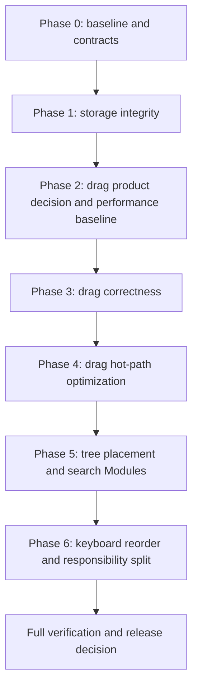

# GeminiNotebook-Source-Management Optimization Hardening Roadmap

> **For agentic workers:** REQUIRED SUB-SKILL: Use superpowers:subagent-driven-development (recommended) or superpowers:executing-plans to implement this roadmap task-by-task. Steps use checkbox (`- [ ]`) syntax for tracking.

**Goal:** 按可验证的风险优先级加固现有扩展：先消除导入、持久化与恢复链路的数据完整性缺口，再修正拖拽 Beta 的迁移、布局与大列表热路径，最后把树结构写入和搜索语义收口为稳定 Module，并补齐精准键盘排序。

**Architecture:** 保留当前本地优先架构（content scripts + MV3 background service worker + `chrome.storage.local`），不新增远程后端、数据库、权限或 host surface。实施分为三个可独立回滚的工作流：Storage Integrity、Drag Correctness & Performance、Architecture & Accessibility。每条工作流先以失败测试固定契约，再做最小实现；跨工作流只通过本文声明的 Interface 交接。

**Tech Stack:** Chrome Extension Manifest V3、Vanilla JavaScript IIFE factory、`globalThis.NSM_CREATE_*`、Chrome Storage API、Jest、Playwright headless smoke、ESLint、仓库现有 package verifier。

**Global Constraints:**

- `manifest.json` 是 content script 的真实依赖顺序；新增 content helper 时，同步 `tests/helpers/load-content-module.js`、`tests/helpers/content-test-harness.js` 与 `docs/PROJECT_DIRECTORY.md`。
- NotebookLM 原生 DOM 仍按高风险边界处理：不用生成 CSS class，不把隐藏 DOM 当删除证据，不放宽删除/改名的 fresh-row 校验。
- 开发者日志只记录计数、布尔值、稳定事件名、原因码、source key/hash；不得记录来源标题、正文、标签/文件夹名称、完整私有 URL 或原始导入 JSON。
- 不机械拆分大文件；只有形成单一职责、稳定 Interface 且至少有两个调用方时才创建 Module。
- 每个任务使用 TDD：先加失败测试并观察预期失败，再写最小实现；每个任务结束运行列出的 focused test。
- 每个有 runtime、测试、文档、配置或工作流影响的任务同步更新 `CHANGELOG.md`；结构、模块、存储契约、消息或测试入口变化同步更新 `docs/PROJECT_DIRECTORY.md` 及对应权威文档。
- 每条专项计划独立提交；不修改版本号、不生成正式 release section、不执行 `git push`。
- 开始 Task 1 前执行 `git rev-parse HEAD`，把返回的 40 位 commit 写入
  `docs/superpowers/reports/2026-07-26-optimization-baseline.md` 唯一的
  `Roadmap Start SHA:` 字段；不得依赖跨 shell 不会保留的临时环境变量。每个 commit 前
  运行 `git diff --check`，commit 后运行
  `git show --check --oneline --stat HEAD`，最终用 start SHA 检查已提交 patch。

---

## Confirmed Optimization Register

| Priority | Area | Confirmed gap | Target invariant | Detailed plan |
|---|---|---|---|---|
| P0 | Import | `applyImportConfig` 在 critical save 成功前已改 runtime；save 失败不回滚 | 明确 pre-commit reject 时 runtime/persisted 均不变；ack ambiguous 时 runtime 回滚并保留 pre-import recovery，等待重载 reconciliation | [Storage Integrity](./2026-07-26-storage-integrity-hardening.md) |
| P0 | Storage versions | `schemaVersion > 5` 会落入 legacy 分支；未知 `formatVersion` 未 fail closed | 未来 schema / envelope 明确拒绝，旧 raw-state 兼容边界有测试 | [Storage Integrity](./2026-07-26-storage-integrity-hardening.md) |
| P0 | Save ordering | page lifecycle 可绕过 background FIFO；`LOAD_STATE` 不等待同 key save | 同 notebook 的 save/load/history/log 写入按明确队列与 revision contract 串行 | [Storage Integrity](./2026-07-26-storage-integrity-hardening.md) |
| P0 | Drag mode | 全局切回 Classic 只清理当前 notebook，其他 notebook 可保留 Classic 无法表达的 positioned root source | 每个 notebook 加载时按当前全局模式执行幂等迁移并 critical save | [Drag Correctness](./2026-07-26-drag-correctness-and-performance.md) |
| P0 | Reflow | fold 使用 `offsetHeight`，未计真实 sibling stride；content-box 展开时写回 border-box 高度 | 折叠槽位使用 Chromium 实际 vertical footprint（含 margin-collapse 结果），展开恢复原 inline style | [Drag Correctness](./2026-07-26-drag-correctness-and-performance.md) |
| P1 | Drag hot path | dragover 内存在重复 DOM 查询、跨阶段读写与第二轮 collapsed-group 扫描 | 一帧一次 geometry snapshot；读阶段完成后才写视觉状态；100/500 行有预算门 | [Drag Correctness](./2026-07-26-drag-correctness-and-performance.md) |
| P1 | Filtered drag | “最后可见项之后”在 root/group 的底层 index 映射缺少统一产品契约 | 先确认 anchor-relative 或 container-end，再让所有 drag type 共用 typed-identity resolver | [Drag Correctness](./2026-07-26-drag-correctness-and-performance.md) |
| P1 | Quota/history | emergency trim 可把 history 直接压到最新一条，删除手动恢复点 | 自动清理不删除 manual restore point；空间不足时拒绝增长写入 | [Storage Integrity](./2026-07-26-storage-integrity-hardening.md) |
| P1 | Developer logs | append 是未排队的 read-modify-write；clear/load 可与 append 竞争；部分 route 未把 key 精确绑定 sender notebook | 同 key append/clear FIFO、load 等待 pending task；所有日志 route 做 sender↔notebook key 绑定 | [Storage Integrity](./2026-07-26-storage-integrity-hardening.md) |
| P1 | Tree mutations | drag、batch、move modal、sync、state apply 各自直接改 `root/ungrouped/group.children` | 一个 Tree Placement Module 负责 validate → plan → commit 与不变量 | [Architecture](./2026-07-26-architecture-deepening-and-accessibility.md) |
| P1 | Search | `content-view-state.js` 与 `content-render.js` 重复 parser、matcher 与 highlight normalization | 一个 Search Semantics Module 统一 query 语法、匹配和纯文本 segmentation；UI state/result count 留在 view/render Adapter | [Architecture](./2026-07-26-architecture-deepening-and-accessibility.md) |
| P1 | Accessibility | draggable row 无精准键盘上移/下移/缩进/移出父级 | 在现有可键盘操作的 action controls 提供四方向命令，映射到 Tree Placement Interface，焦点与播报可验证 | [Architecture](./2026-07-26-architecture-deepening-and-accessibility.md) |
| P2 | Preferences/logging | `content-developer-logger.js` 同时拥有偏好持久化与日志职责 | 在高风险修复稳定后必须拆成 Preferences 与 Logger 两个 Module，外部函数签名不变 | [Architecture](./2026-07-26-architecture-deepening-and-accessibility.md) |

“拖拽卡顿”目前只有结构性热路径证据，没有真实设备 profiler 结论。因此计划先建立 100/500 行 deterministic budget，再依据测量结果优化；不预先宣称某一视觉卡顿已被复现。

---

## Cross-Plan Interfaces

### Storage and Migration Results

不强行把 storage、import 与 migration 压成一个 shallow result。三条 Interface 分别是：

```javascript
SaveResult = {
    ok: boolean,
    reason?: 'stale_revision' | 'equal_revision_conflict' |
        'storage_quota_exceeded' | 'runtime_unavailable' |
        'runtime_message_error' | 'runtime_exception' |
        'empty_response' | 'runtime_failure' |
        'unsupported_schema',
    saveRevision?: number,
    usageInfo?: object,
    runtimeResult?: object,
    localResult?: object
}

ImportApplyResult = {
    ok: boolean,
    reason?: 'invalid' | 'deferred' | 'save_failed' |
        'storage_quota_exceeded' | 'rollback_failed' |
        'import_ack_unknown',
    rolledBack?: boolean,
    totalSources?: number,
    matchedSources?: number
}

ClassicMigrationResult = {
    changed: boolean,
    saved: boolean,
    reason?: 'not_classic' | 'preferences_unverified' |
        'stale_instance' | 'checkpoint_failed' |
        'storage_quota_exceeded' | 'stale_revision' |
        'runtime_failure'
}
```

调用方不得把 `SaveResult.ok:false` 当作已保存；import/migration Adapter 把 SaveResult
翻译成自己的 result，不重命名 `saveRevision`。导入和模式迁移必须保留恢复路径并显示
error status。

### Tree Placement Contract

```javascript
PlacementItem =
    { kind: 'group', id: string } |
    { kind: 'source', key: string }
TreeTarget =
    { container: 'root', index: number } |
    { container: 'ungrouped', index: number } |
    { container: 'group', groupId: string, index: number }
```

persisted tree 内部仍使用 `{ type: 'group'|'source', ... }` entry；Adapter 只传
`PlacementItem + TreeTarget`。所有拖拽、批量移动、移动 modal、键盘排序和 sync/apply
修复最终通过 `previewPlacement(...)`、`applyPlacement(...)` 与
`applyBatchPlacement(...)`；跨多条 command 的原子操作使用
`applyPlacementTransaction(...)`，group create/source delete/group dissolve 使用专项计划
定义的 structural command。调用方不得重新实现去重、循环检测、多项稳定排序或部分
commit。

### Drag Geometry Contract

同一 animation frame 内只生成一次只读 snapshot；drop intent、collapsed-group hover 和 reflow 只消费 snapshot，不重新查询 DOM。视觉 class/style 写入必须发生在 snapshot 完整生成之后。

---

## Delivery Order



- Phase 1 在 drag correctness 前：Classic 迁移依赖可信的 critical save/load/recovery。
- Phase 2 先确认 filtered last-visible semantics，并在任何 drag runtime 变更前建立同机
  100/500 行 callback CPU、1/50-selection prepare CPU/forced-layout 与 DOM-call baseline。
- Phase 4 在 correctness 后：hot-path refactor 必须保持已确认 semantics 与 box-model tests。
- Phase 5 在拖拽行为稳定后迁移共享 Module，避免重构同时改变交互。
- Phase 6 最后：键盘排序直接复用 Tree Placement Interface，不新建第二套树写入逻辑。

---

## Task 1: 冻结基线并建立执行台账

**Files:**
- Read: `package.json`
- Read: `manifest.json`
- Read: `docs/STORAGE_SCHEMA.md`
- Read: `docs/MESSAGE_CONTRACTS.md`
- Read: `UI_GUIDELINES.md`
- Create during implementation: `docs/superpowers/reports/2026-07-26-optimization-baseline.md`
- Modify during implementation: `docs/PROJECT_DIRECTORY.md`
- Modify during implementation: `CHANGELOG.md`

**Interfaces:**
- Consumes: 当前 `npm run lint`、`npm run test:unit`、`npm run test:smoke`、`npm run package` 入口。
- Produces: 一份只记录命令、通过数、失败名、环境和 roadmap start SHA 的 repository
  baseline；drag 计数要等 Drag Task 2 创建 benchmark 后再回填，不得伪造；不得写来源标题或
  notebook 私有数据。

- [ ] **Step 1: 运行无变更基线**

Run: `npm run lint`

Expected: PASS，0 errors / 0 warnings。

Run: `npm run test:unit`

Expected: PASS；记录 suite/test 总数，不接受 snapshot 更新。

Run: `npm run test:smoke`

Expected: PASS，默认 headless。

- [ ] **Step 2: 写 baseline report**

报告固定包含：

```md
## Environment
## Plan Start SHAs
## Commands and Results
## Confirmed Failing Contracts
## Drag Benchmark Reference
## Completed Work
## Deferred Non-Blocking Observations
```

“Confirmed Failing Contracts” 只列各专项计划将先写出的红测试名，不把尚未执行的推断写成失败事实。
`Drag Benchmark Reference` 此时只写将由 Drag Task 2 生成的文档路径，不填写 counters。
`Plan Start SHAs` 先写一行 `Roadmap Start SHA:`，其 backtick 值必须是 Step 1 前
`git rev-parse HEAD` 的原始 40 位输出；后续三个专项在各自 Task 1 前补自己的唯一字段。

- [ ] **Step 3: 验证文档**

Run: `git diff --check -- docs/superpowers/reports/2026-07-26-optimization-baseline.md docs/PROJECT_DIRECTORY.md CHANGELOG.md`

Expected: PASS；报告中的每个路径存在。

- [ ] **Step 4: Commit**

```bash
git add docs/superpowers/reports/2026-07-26-optimization-baseline.md docs/PROJECT_DIRECTORY.md CHANGELOG.md
git commit -m "docs: record optimization hardening baseline"
```

---

## Task 2: 执行 Storage Integrity 工作流

**Files:**
- Plan: `docs/superpowers/plans/2026-07-26-storage-integrity-hardening.md`
- Main implementation: `src/utils/storage-contract.js`, `src/background/index.js`, `src/content/content-persistence.js`, `src/content/content-import-export.js`, `src/content/index.js`
- Contracts: `docs/STORAGE_SCHEMA.md`, `docs/MESSAGE_CONTRACTS.md`

**Interfaces:**
- Consumes: `SaveResult`、`ImportApplyResult`。
- Produces: future-version fail-closed、atomic import rollback、同 notebook FIFO、manual history retention、sender-bound serialized developer logs。

- [ ] **Step 1: 按专项计划 Task 1→7 顺序执行，不跳过红测试**
- [ ] **Step 2: 每个 task 后运行其 focused Jest 命令**
- [ ] **Step 3: 完成专项计划的 lint → unit → smoke → package → diff-check gate**
- [ ] **Step 4: 记录最终 commit hash 到 baseline report 的 `Completed Work` 段**

Expected: 导入收到明确 pre-commit reject 后 runtime 与 persisted snapshot 均为导入前；
response 丢失等 ack ambiguous 情况下 runtime 回滚且 pre-import recovery 保留并在重载时
显式提供 reconciliation；未来 schema/envelope 被明确拒绝；同 key load 观察到此前已排队
save；manual restore point 不被 emergency trim 删除。

---

## Task 3: 执行 Drag Correctness & Performance 工作流

**Files:**
- Plan: `docs/superpowers/plans/2026-07-26-drag-correctness-and-performance.md`
- Main implementation: `src/content/content-drag-reflow.js`, `src/content/content-drag-multi.js`, `src/content/content-tree-interactions.js`, `src/content/index.js`
- UI contract: `UI_GUIDELINES.md`

**Interfaces:**
- Consumes: `SaveResult`、`ClassicMigrationResult`、当前 `dragMode` preference。
- Produces: per-notebook Classic normalization、box-model-safe reflow、同步 dropEffect、filter anchor semantics、auto-scroll intent refresh、100/500 行 performance budget。

- [ ] **Step 1: 完成 filtered last-visible Product Decision Gate**
- [ ] **Step 2: 在 runtime 变更前执行 Drag Task 2，建立 100/500 行 baseline**
- [ ] **Step 3: 执行 Classic/reflow correctness tasks**
- [ ] **Step 4: 执行 geometry snapshot、auto-scroll、dropEffect tasks**
- [ ] **Step 5: 完成专项计划 full verification gate**
- [ ] **Step 6: 把实测 callback/prepare CPU、forced-layout phases 与 DOM counters 回填
  baseline report；只报告测得的改善**

Expected: Classic 下不存在 positioned root source；带 margin/padding/border 的 animated cancel/unfold 恢复原尺寸；500 行 fixture 不超过专项计划预算；静止指针 auto-scroll 时 intent 继续刷新。

---

## Task 4: 执行 Architecture & Accessibility 工作流

**Files:**
- Plan: `docs/superpowers/plans/2026-07-26-architecture-deepening-and-accessibility.md`
- New Modules: `src/content/content-tree-placement.js`, `src/content/content-search-semantics.js`, `src/content/content-preferences.js`
- Migrated consumers: drag、batch、move modal、source sync、state apply、render、view-state、developer logger、`index.js`

**Interfaces:**
- Consumes: Tree Placement Contract；既有 search/filter inputs；现有 preference message contract。
- Produces: 树写入单一所有者、搜索 parser/matcher/highlight semantics 单一所有者、键盘精准排序、preferences/logger 职责分离。

- [ ] **Step 1: 先建纯 Module 测试和 loader-order guard**
- [ ] **Step 2: 一次只迁移一个调用方；每次迁移后跑该调用方 focused test**
- [ ] **Step 3: 删除重复逻辑前用 `rg` 证明生产调用点已迁空**
- [ ] **Step 4: 完成 keyboard interaction + live announcement tests**
- [ ] **Step 5: 完成专项计划 full verification gate**

Expected: 任何 tree move 都先 validate 再 commit；调用方不再直接实现去重/循环检测；
render 与 view-state 对同一查询使用同一 parsed criteria 和 match 结论；结果计数仍由 UI
Adapter 从统一 match 结果推导；键盘移动后焦点留在被移动 row。

---

## Task 5: 集成验收与发布决策

**Files:**
- Verify: `manifest.json`
- Verify: `package.json`
- Verify: `package-lock.json`
- Verify: `README.md`
- Modify: `CHANGELOG.md`
- Verify: `docs/PROJECT_DIRECTORY.md`
- Modify: `docs/superpowers/reports/2026-07-26-optimization-baseline.md`
- Verify: `release/gemininotebook-source-management-${PACKAGE_VERSION}.zip`，其中
  `PACKAGE_VERSION` 必须从 `package.json` 读取；文件由 `npm run package` 生成，不手工编辑

**Interfaces:**
- Consumes: 三个专项工作流的 commits 与完整测试结果。
- Produces: 可发布/不可发布结论；本任务不自动改版本号或 push。

- [ ] **Step 1: 运行完整验证**

Run: `npm run verify:full`

Expected: lint、unit、headless smoke 全部 PASS。

Run: `npm run package`

Expected: PASS；package verifier 证明计划、报告、测试和开发文档未进入发布 zip。

Run:

```bash
PACKAGE_VERSION=$(node -p "require('./package.json').version")
test -f "release/gemininotebook-source-management-${PACKAGE_VERSION}.zip"
```

Expected: PASS；实际 zip 名与当前 `package.json` version 精确一致。

- [ ] **Step 2: 检查无占位符**

Run:

```bash
if rg -n "[T]ODO|[T]BD|[F]IXME|[X]XX|s[i]milar|and[ ]so[ ]on|e[t]c\.|[p]laceholder|documented[ ]interface[ ]below" \
  docs/superpowers/plans/2026-07-26-*.md; then
  echo "Unresolved plan marker found" >&2
  exit 1
fi
```

Expected: 无输出。代码中的既有待办标记不在本次文档扫描范围。

- [ ] **Step 3: 检查 Module 同步**

Run: `npx jest tests/manifest-loader-sync.test.js tests/package.test.js`

Expected: PASS；manifest、Node loader、harness globals 双向一致，新增内部文档不进入 zip。

- [ ] **Step 4: 手工只读验收清单**

- 导入失败回滚：分别注入明确 pre-commit reject 与“background 可能已 commit、response
  丢失”两种 failure；前者确认 UI/runtime/reload persisted 均为导入前，后者确认 runtime
  回滚、pre-import recovery 标记 `import_ack_unknown`，重载时显式提供 reconciliation，
  不把 primary 静默视为已确认导入。
- Classic 迁移：准备另一个 notebook 的 positioned root source，切 Classic 后加载该 notebook，确认扫入 ungrouped 且保存成功。
- Reflow：在带 padding/border/margin 的 source row 上拖拽并取消，确认高度不跳变。
- 大列表：使用 synthetic 500-row fixture 读取 counter，不使用真实来源标题。
- 键盘排序：逐项验证 action controls 的上移、下移、移入、移出、disabled boundary、焦点保持和 live announcement。

- [ ] **Step 5: 完成 execution report 并提交**

在 `## Completed Work` 写入：

- Storage/Drag/Architecture 各自最后一个 verified commit hash；
- drag benchmark before/after 的 100/500 row callback CPU、1/50-selection prepare CPU
  p50/p95、forced-layout phases 与 DOM call totals；
- full verification、package、五项手工验收的实际命令/结果；
- 未完成项、已知限制与 provisional release decision。

不得写私有 notebook/source 数据，不得把未运行检查标成 PASS。同步更新
`CHANGELOG.md` 的 Unreleased 文档/验证条目，说明 execution report 已记录实际结果；
不得创建 release section 或声称已发布。然后：

```bash
git diff --check -- \
  docs/superpowers/reports/2026-07-26-optimization-baseline.md \
  CHANGELOG.md
git add docs/superpowers/reports/2026-07-26-optimization-baseline.md CHANGELOG.md
git commit -m "docs: record optimization hardening results"
git show --check --oneline --stat HEAD
```

Expected: PASS；report 与对应 changelog 更新已提交，working tree 无本路线图遗留修改。

- [ ] **Step 6: 重新运行最终 package/range gate**

Run:

```bash
npm run verify:full
npm run package
PACKAGE_VERSION=$(node -p "require('./package.json').version")
test -f "release/gemininotebook-source-management-${PACKAGE_VERSION}.zip"
ROADMAP_START_SHA=$(sed -nE \
  's/^Roadmap Start SHA: `([0-9a-f]{40})`$/\1/p' \
  docs/superpowers/reports/2026-07-26-optimization-baseline.md | tail -n 1)
test -n "$ROADMAP_START_SHA"
git cat-file -e "${ROADMAP_START_SHA}^{commit}"
git diff --check
git diff --check "$ROADMAP_START_SHA"..HEAD
```

Expected: PASS；最终 report commit 也进入 range，package 仍排除 plans/reports/tests。

- [ ] **Step 7: 发布决策**

只有以下条件全部满足才建议进入独立 release/version task：

1. 三条专项计划无未完成 P0/P1 条目；
2. `verify:full` 与 `package` 通过；
3. 手工只读验收五项通过；
4. 无新增权限、依赖、远程服务或私有数据日志；
5. working tree 只含已知用户文件和本路线图范围内改动。

若任一条件失败，保留当前版本号与 Unreleased 状态，并在 baseline report 写明具体失败命令、测试名和下一步；不得用“基本通过”代替 release gate。

---

## Rollback Boundaries

- Storage：以专项 commit 为边界；任何 schema/import contract 回归都整体回滚 Storage 工作流，不回退用户 storage。
- Drag correctness：Classic migration 与 reflow box-model 分开提交，可单独回滚；不得回滚已写入用户树数据，必须通过相反的幂等迁移处理。
- Drag performance：纯 geometry snapshot/缓存提交可单独回滚，行为测试必须保持全绿。
- Architecture：按 consumer 迁移提交回滚；Tree Placement Module 在最后一个 consumer 迁移前保留旧路径，避免半迁移状态。
- Accessibility：键盘 controls 与 tree placement 分开提交；若 controls/focus 出现回归，只回滚 UI Adapter，不复制树写入逻辑。
